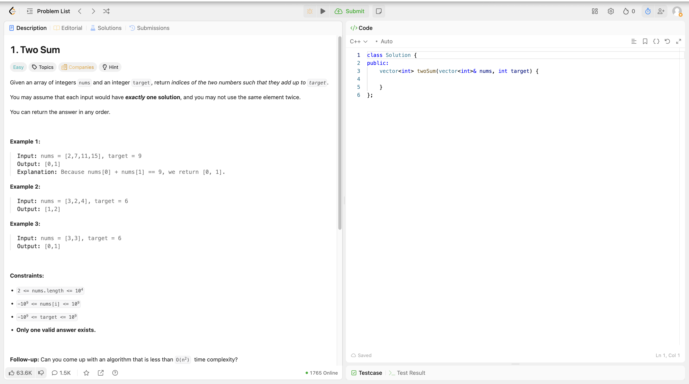
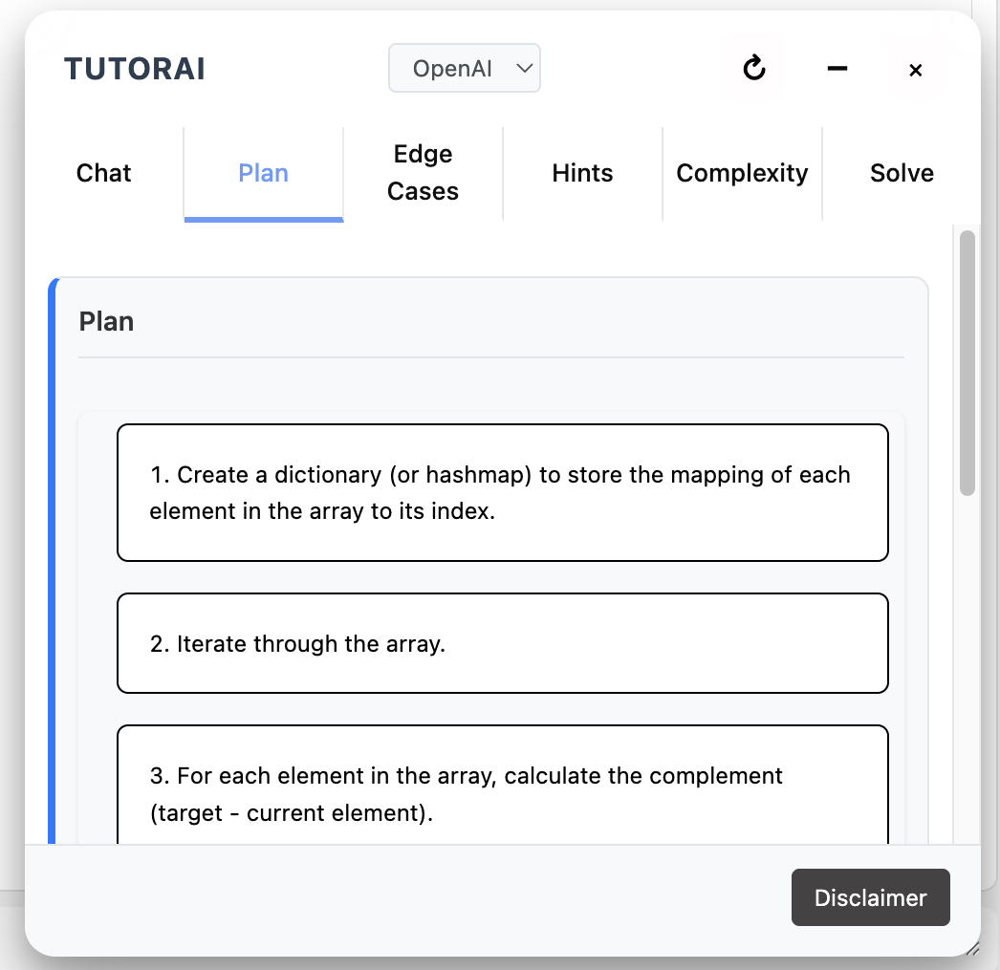
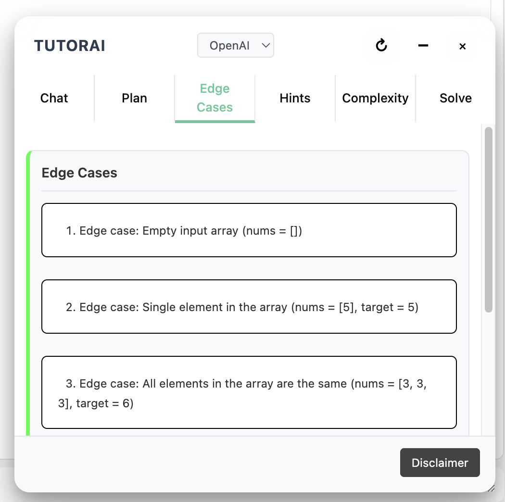
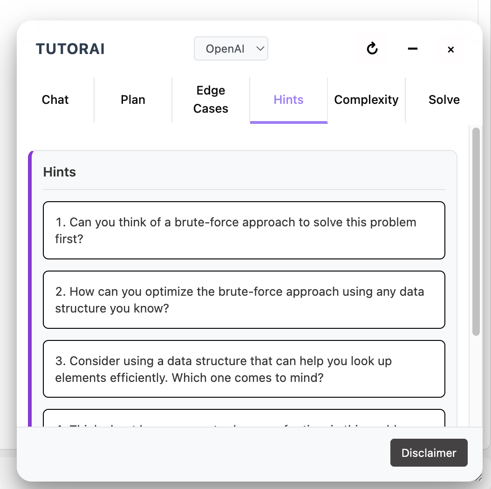
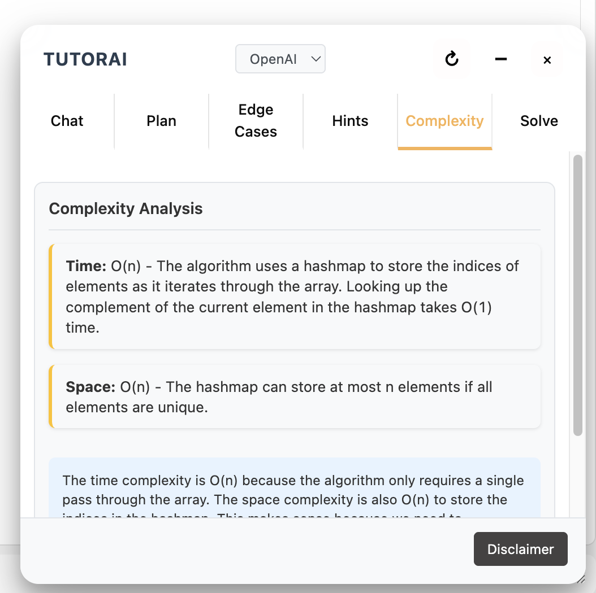
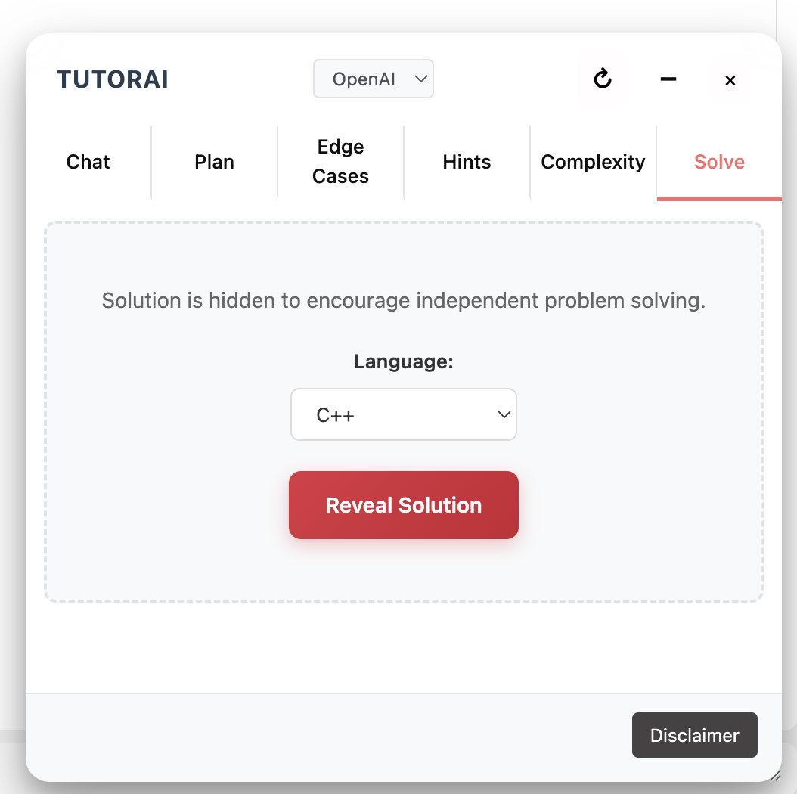
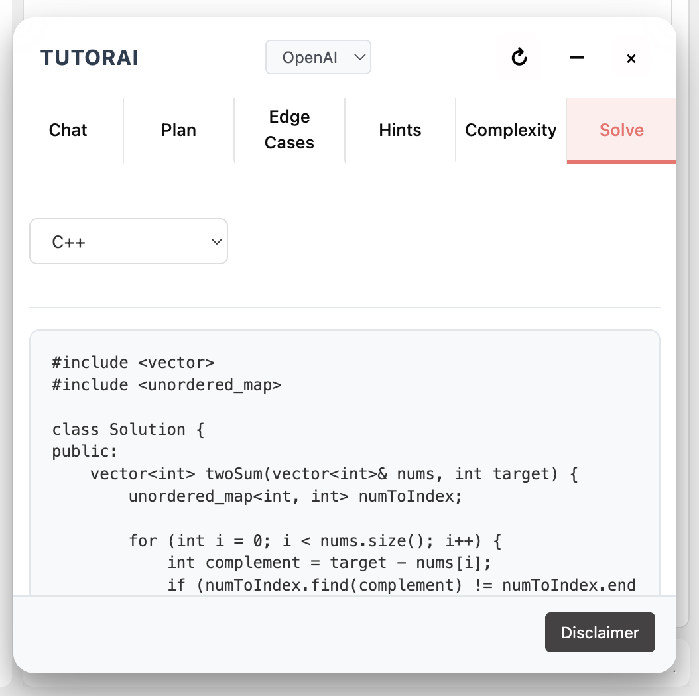
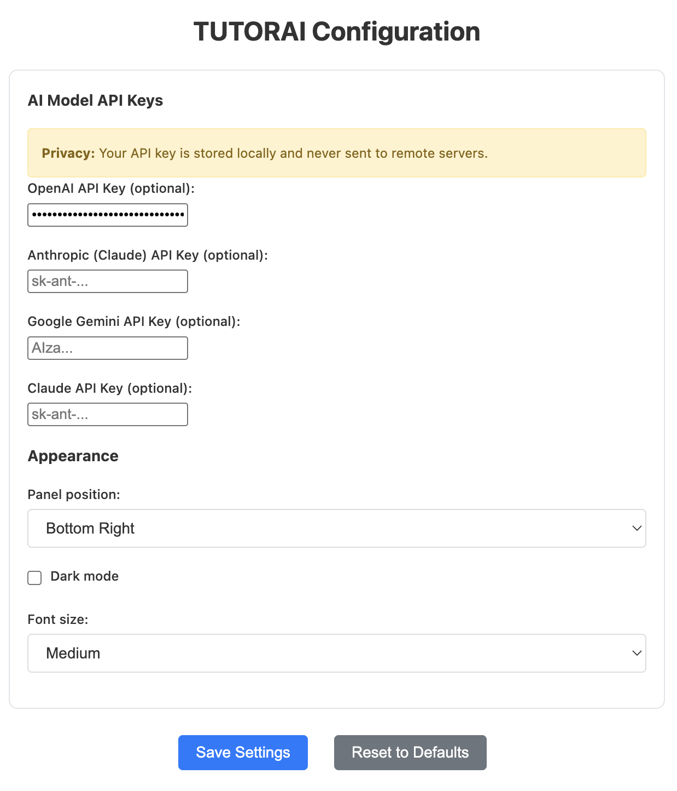

# TUTORAI


A privacy-preserving AI tutor for LeetCode that provides hints, solutions, and interactive tutoring.

## Disclaimer

TUTORAI is a browser extension that:

- Reads LeetCode problem descriptions from the webpage
- Provides AI-powered hints and guidance for learning
- Analyzes code complexity and suggests improvements
- Helps users understand problem-solving approaches
- Works only on LeetCode problem pages at this current time (not during contests)

## Features

### Example



### Interface

<div style="display: grid; grid-template-columns: repeat(auto-fit, minmax(350px, 1fr)); gap: 20px;">
  
  
  
  
  
  
</div>

### Solution Analysis

<div style="display: flex; gap: 20px; flex-wrap: wrap;">

  
</div>

### Configuration



## Quick Setup

1. **Install & Build**

   ```bash
   npm install
   npm run build
   ```

2. **Load Extension**
   - Open Chrome → `chrome://extensions/`
   - Enable "Developer mode"
   - Click "Load unpacked" → select `dist` folder

3. **Configure API Keys**
   - Click extension icon → "Options"
   - Add your API keys for OpenAI, Anthropic, or Google Gemini

4. **Start Learning**
   - Go to any LeetCode problem
   - Press `Ctrl+Shift+L` or click extension icon
   - Get AI-powered tutoring instantly

## Privacy First

All processing happens in your browser. Your API keys and data never leave your device.
