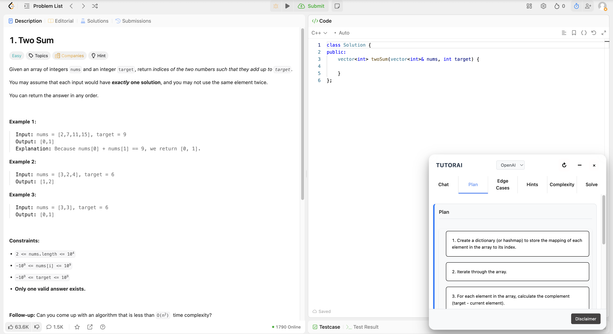
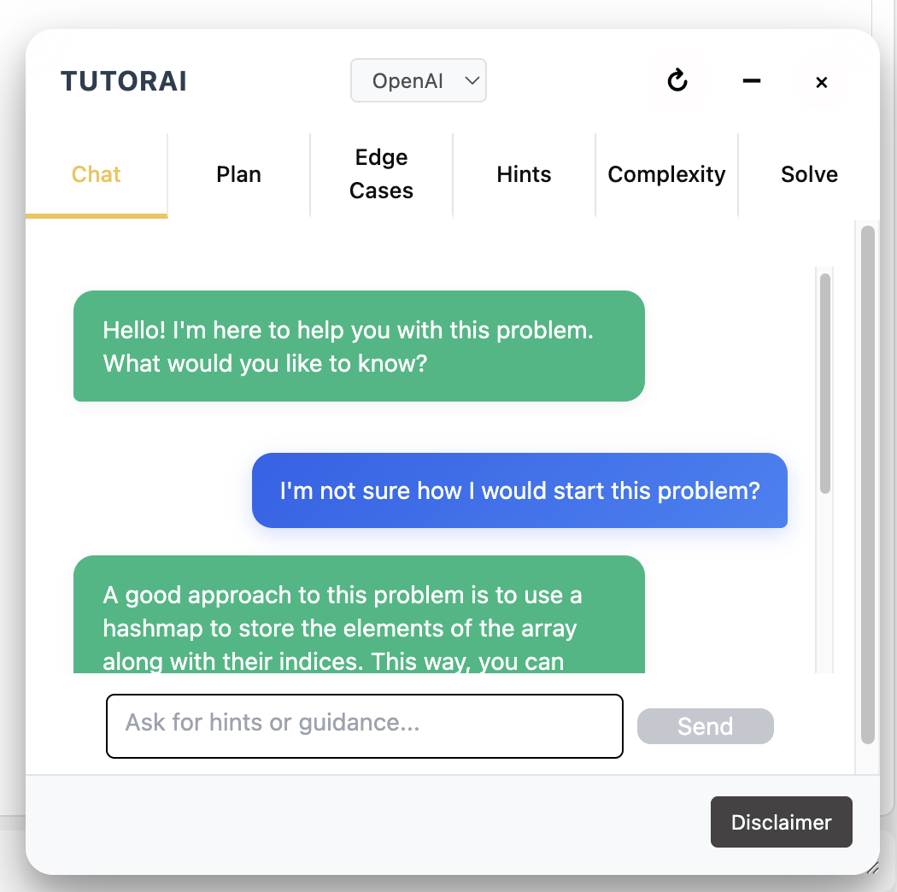
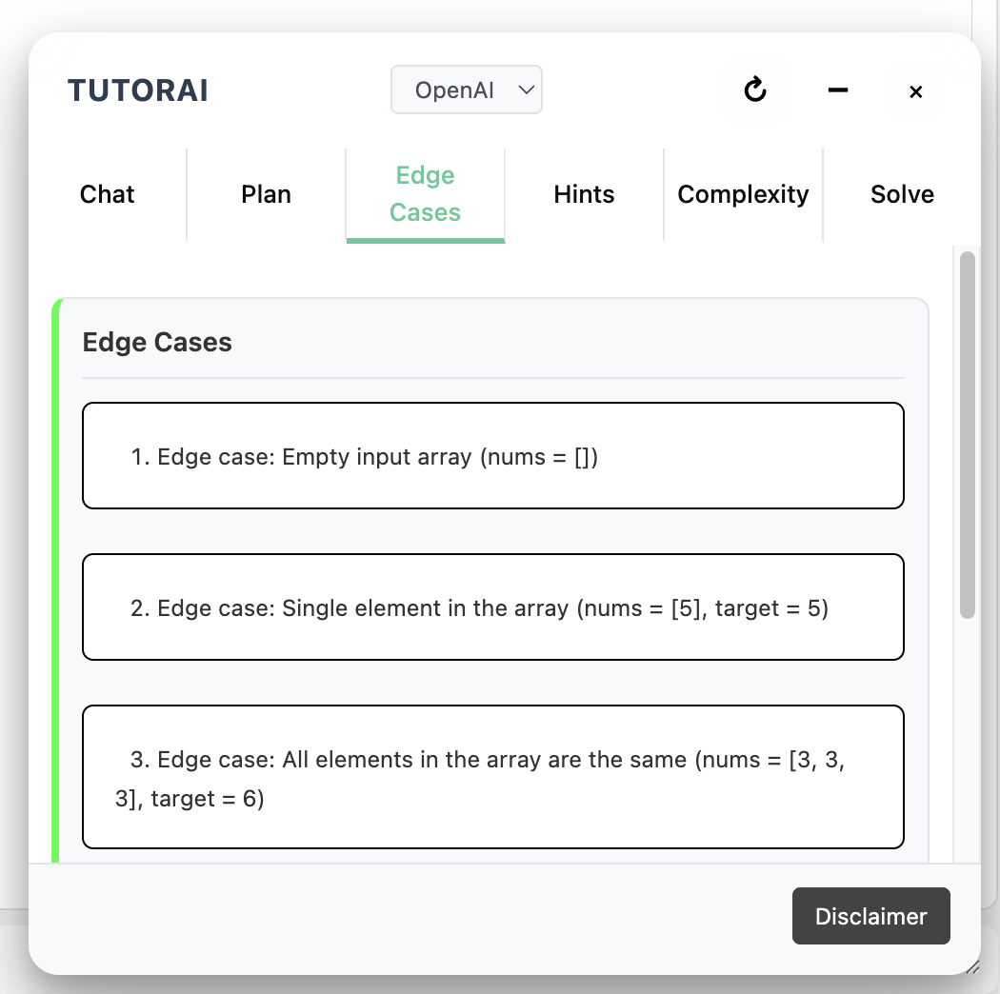
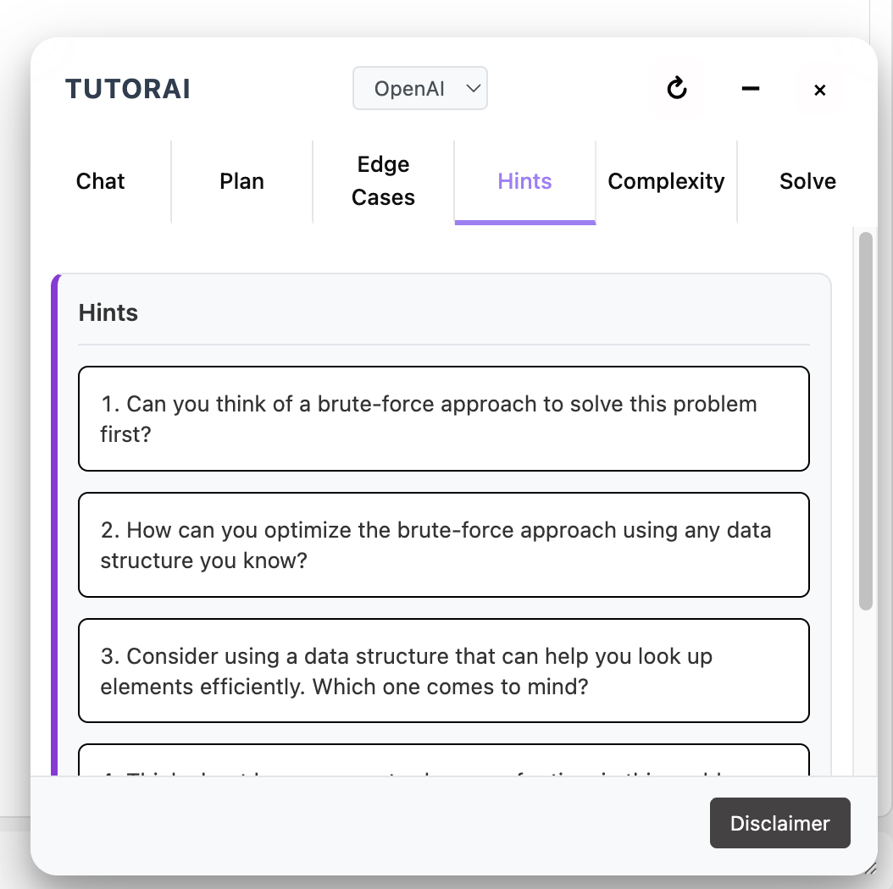
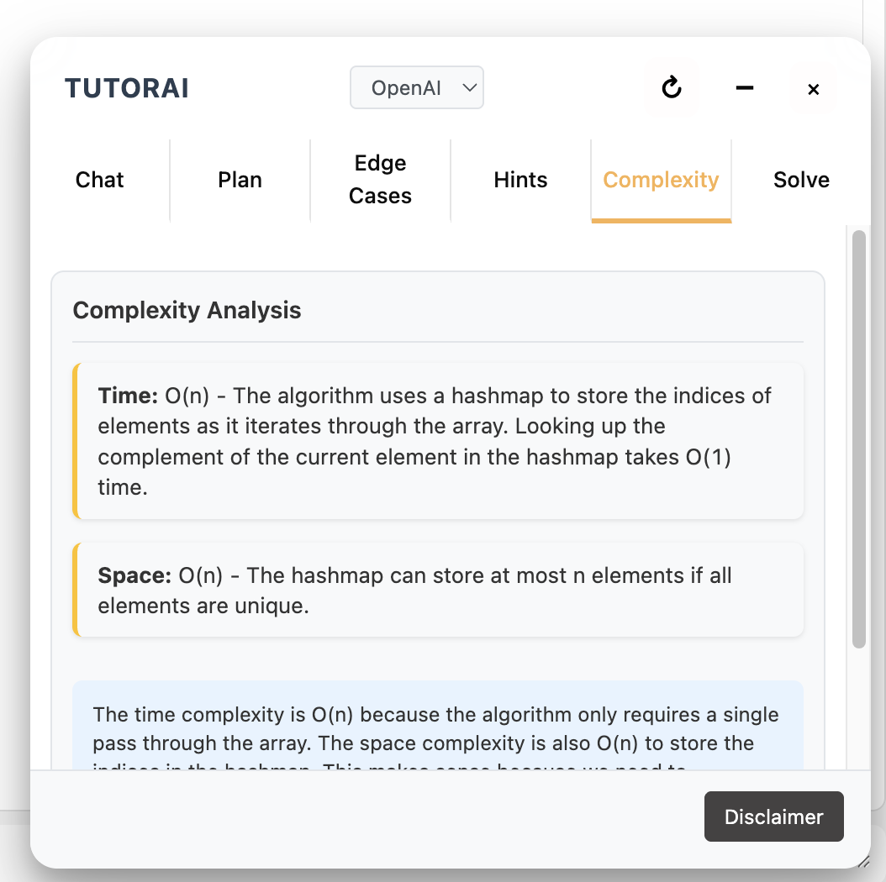
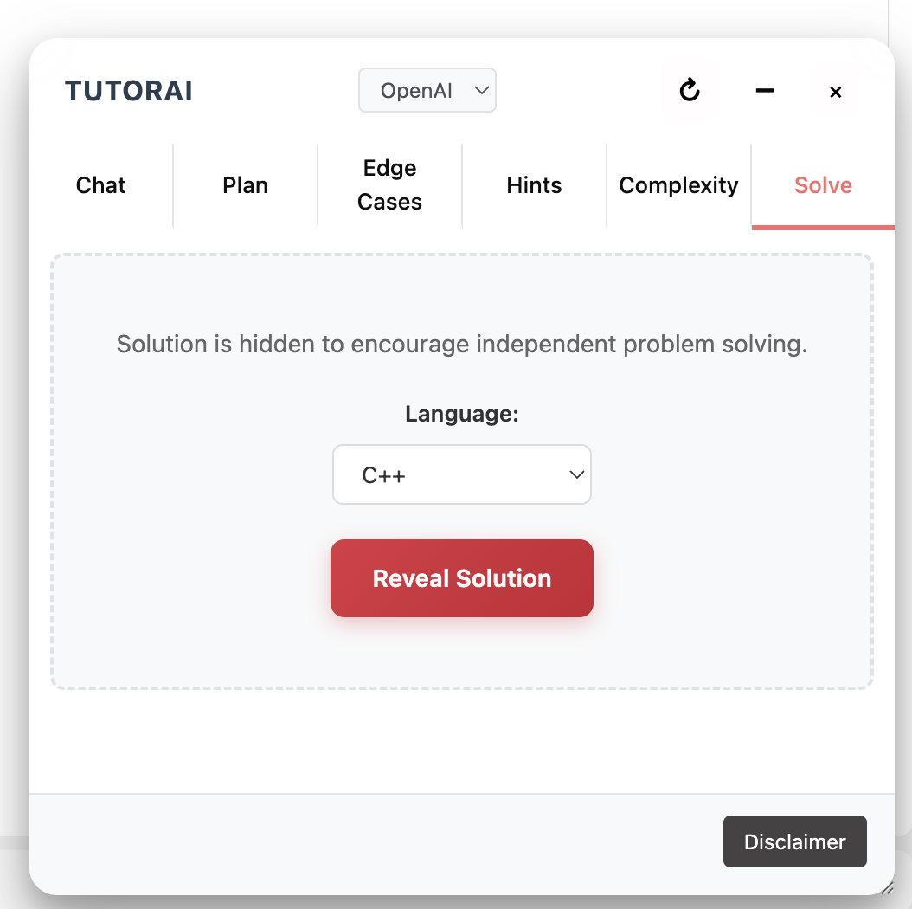
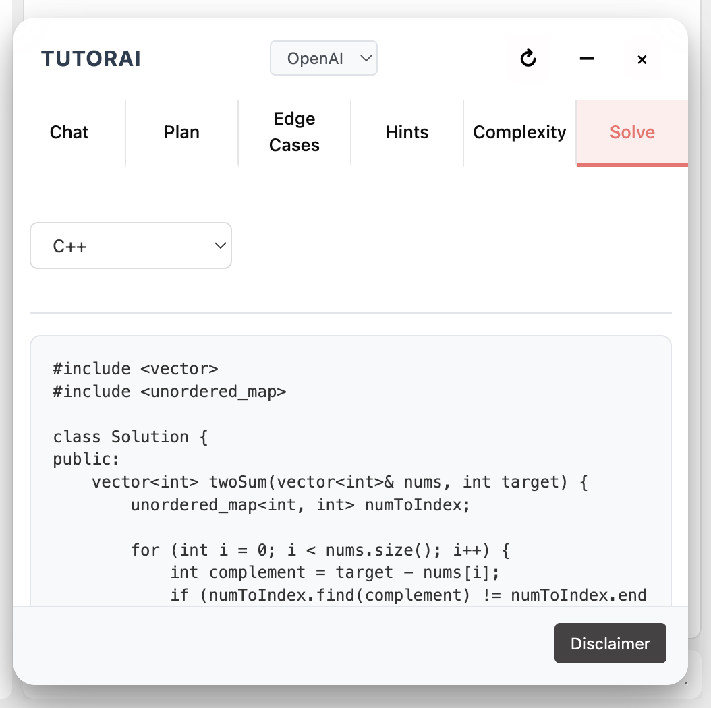
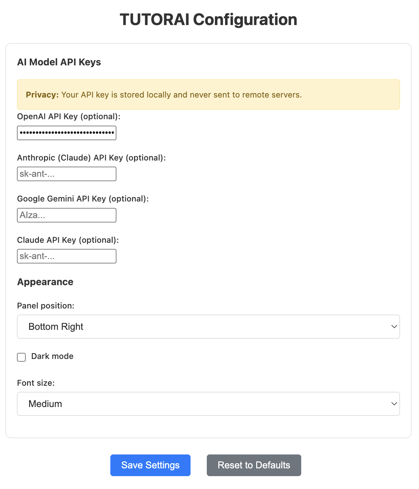

# TUTORAI

A privacy-preserving AI tutor for LeetCode that provides hints, solutions, and interactive tutoring.

## Features










## Quick Setup

1. **Install & Build**

   ```bash
   npm install
   npm run build
   ```

2. **Load Extension**
   - Open Chrome → `chrome://extensions/`
   - Enable "Developer mode"
   - Click "Load unpacked" → select `dist` folder

3. **Configure API Keys**
   - Click extension icon → "Options"
   - Add your API keys for OpenAI, Anthropic, or Google Gemini

4. **Start Learning**
   - Go to any LeetCode problem
   - Press `Ctrl+Shift+L` or click extension icon
   - Get AI-powered tutoring instantly

## Privacy First

All processing happens in your browser. Your API keys and data never leave your device.
